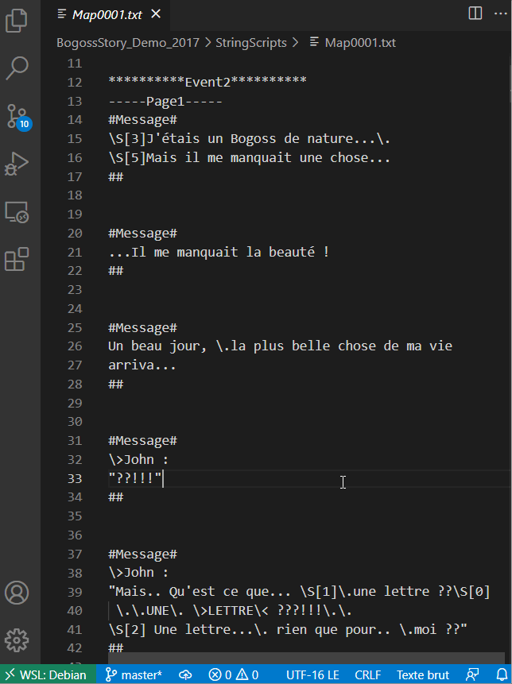
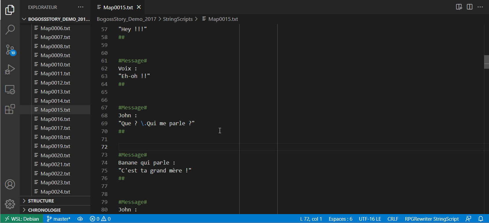

# `rpgrw-vscode` : Extension for RPGRewriter StringScripts

[RPGRewriter](https://vgperson.com/posts.php?p=rpgmakerguide) is a translation assistant made by [vgperson](https://vgperson.com/about.htm) for **RPG Maker 2000/2003 games**.

This extension doesn't include *RPGRewriter*, but helps to make the files extracted by the application (.txt, StringScripts) more comfortable to edit... just for you!

---

## Features

* ### Syntax highlighting

This extension adds a language arbitrary called "RPGRewriter StringScripts (rpgrw)"
Its syntax highighting permit to distinguish the text to translate from the message commands (`\C[x]`, `\S[x]`, `\V[x]`, `\.`, `\!`, etc.) and from the StringScripts format (`#Message#`, etc.).



---

* ### StringScripts preview

This extension adds a **preview icon** in the text editor menu to open up a **StringScript Preview** side panel.

The corresponding command is "**RPGRewriter: StringScript Preview**" in the command panel (`Ctrl+Shift+P`).

The purpose is to verify the length of each line in order to keep it below 38 characters for message boxes with faceset, and 50 for message boxes without faceset.

This can't be checked only by add vertical rulers because of all the message commands typed but not showing ingame. Every old RPG Maker users knows how frustrating it is to have the end of a line chopped out of the message box.

This preview panel erase all those commands, except those supposed to show a value (`\V[x]`, `\N[]`), that will prompt "`@@@`" into the preview.

Keep in mind that the "`@@@`" placeholder takes 3 characters long but depending on the value displayed it can be longer or shorter.



---

## How to show vertical rulers in text editor :

Add this in your `settings.json` file:

```json
    // Display rulers at 38 and 50 for RPGRewriter StringScript:
    "[rpgrw]": {
        "editor.rulers": [38, 50]
    }
```

---

## Contributing

This is my first VSCode extension, I would be glad to receive some feedbacks!

You can contribute anytime by opening issues on GitHub or sending pull requests!

---

## Release Notes

### 1.0.0

Initial release of rpgrw-vscode